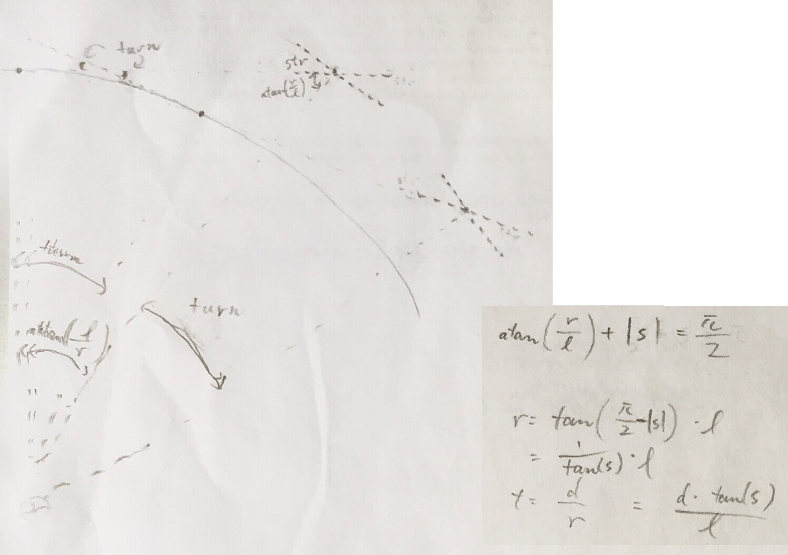

### The model

The WebSocket server receives requests from the simulator containing the measurements about the car's current position and movement as well as the car's pre-determined trajectory. The server converts the coordinates to the car's perspective, such that x axis points to the car's forward direction and y points to the left.

There is a known delay in actuation (actually artificially inserted). The server estimates, using the global kinetic model, what will have happened to the car's states after this delay, given the previously commanded actuation is in effect for the duration of the delay. Whatever actuation the server commands at the present will take effect on a state that should be similar to that estimated state.

In order to optimize the actuation at the present, this estimated future state is transformed over additional future timesteps using the global kinetic model, creating an estimated trajectory, and this trajectory is compared with a pre-determined desired trajectory. The actuation parameters in this series of timesteps are optimized via an optimizer.

The optimizer produces an optimal set of actuation values for the present moment plus all future incremental timesteps.

The server executes the optimal actuation values for the present, but does not retain the rest to be used in the future. Instead, the server commands no actuation until the next measurements come in the form of another request. This is partly because in this simulation, there is no interface to command actuation without having received a request. However, a legitimate reason for discarding future actuation values is that they act on estimated states that quickly become inaccurate.

### Choice of N and dt

The sample pair of N = 25 and dt = 0.05, provided in the MPC quiz, seems to have picked a sweet spot for the overall future duration for which to simulate and optimize the iteration of state changes by global kinetmatic model. `T = N * dt = 25 * 0.05 = 1.25 seconds`. If T was too long, the optimizer may have optimized distal timesteps at a higher proportion, leaving the proximal timesteps less optimized. If T was too short, then the solution may not have prepared the car for the trajectory in the immediate future -- right position but wrong angle, for example.

It seems that tuning T has a non-linear (subjectively speaking) effect on the solution. A slight increase in T might make the solution trajectory to curve wildly in the proximal end. Sometimes, penalizing large delta and/or large `d/dt delta` might fix it. It seemed much better strategy to tune the cost objective function rather than to tune N and dt.

Having experimented with various T, it was reverted to the vicinity of 1.25 seconds. Next, N was reduced, while dt was increased to keep T about the same, in order to reduce the amount of calculation done by the solver over every simulator event. Especially at low target speeds, time resolution is allowed be sparse. The final values were `T = 12 * 0.1 = 1.2 seconds`, i.e. half the time resolution of the quiz's.

### More thoughts

#### Mapping the trajectory

Since we are fitting the trajectory to a polynomial, the path needs to be unique for `x`, whatever vector we choose as `x`. A hairpin turn would be difficult to fit. Since most trajectory travels mostly forward, it makes sense to use the car's forward direction as x axis.

Also, the larger the epsi, the more cte differs from the actual closest distance between the trajectory and the car at the origin. For example, in an extreme case, if the trajectory is almost perpendicular to x but passes near the origin, the cte might register as a very large value, even though the actual distance between the origin and the line is small. To remedy this, maybe it might be better to fit a first-order polynomial to the trajectory and use it as the x axis?

#### Estimating the actuation delay

##### Inside the solver

I previously attempted estimating the actuation delay within the solver. The solver would receive the initial state at the present, not the estimated future state after actuation delay. The solver would hard constrain not only the first timestep of the state vars, but also one or more first timesteps of the actuation vars. These actuation vars would be contrained to one or more historical actuation values. This is technically possible, but is not practical due to code complexity; nor is it accurate unless it so happens that the dt time resolution does not alias the actuation delay, i.e. it's accurate if actuation delay is approximately an integer times dt. This approach is preserved in git branch `ysono/actuation-delay-inside-solver`.

##### Outside the solver, over multiple timsteps

Instead of using one set of actuation values to estimate the consequence of the actuation delay, it should be more accurate to use multiple actuations that happened in the past. My implementation was not successful, however.

For example, if there were actuations 40ms, 90ms, and 115ms ago, all those values would be used.

A simple approach is to average each actuation variable within the last 100ms, and run global kinematic model once. You can activate this strategy this with `./mpc avg`. The result looks slightly better.

A more expensive approach is to iterate the global kinematic model over every past interval between actuations: i.e. use the actuation 115ms ago for (100 - 90 = 10ms), use the actuation 90ms ago for the next (90 - 40 = 50ms), and use the actuation 40ms ago for 40ms. You can activate this strategy with `./mpc interative`. The result, however, is a *more* pronounced delay, not less. There is something wrong with my implementation.

`./mpc` without arguments runs with solver with the one previously stored actuation values.

Note to the reviewer, if the code is hard to follow, simplified code that supports the case of `strategy == one` only is available at an older git branch `ysono/actuation-delay-one`.

#### An attempt to manage curves more intelligently

The goal was to reduce speed in anticipation of a corner.

First I added centripetal acceleration as a set of variables. The idea was to penalize longitudinal and lateral accelerations both being large in their absolute values.

Centripetal acceleration = `v ^ 2 / r`.
Using bicycle model, `radius = length_of_vehicle / tan(steering)`.
Centripetal acceleration = `v ^ 2 * tan(steering) / length_of_vehicle`



Adding centripetal acceleration involved:

- Estimating the actuation-delayed centripetal acceleration, to be used as the 7th state, for the initial solver timestep
- Adding to vars, bounds of vars, and constraints on vars over N timestamps
- Using centripital acceleration in the cost function

For all the added code complication, it was not not clear how the vars should be used to improve the cost function. In fact, its inclusion caused the solution trajectory to be either negligibly worse or much worse. There might have been some mistakes with math that caused this (e.g. mph had not been converted correctly).

The second attempt was to use existing six state variables for the same effect. I added this correlational cost which penalizes steering and velocity both being large:

```cpp
fg[0] = some_multiplier *
  CppAD::pow(vars[delta_start + t] / some_normalizer, 2) *
  CppAD::pow(vars[v_start + t + 1] / another_normalizer, 2);
```

However, this too did not improve the trajectory qualitatively in any way; it only slowed down speed at all times, not just around corners. So both of these attempts were removed (after git commit `a50d94`). So, basically the current solver is identical to what's provided in the solution for the MPC quizz, aside from refactoring of the cost function.
